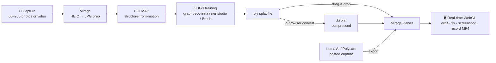

# Mirage

**A browser-based 3D Gaussian Splatting viewer — capture reality with a phone, explore it as a real-time photorealistic scene.** WebGL performance engineering + modern radiance-field graphics.

Point a phone at an object or a room, run it through a splatting pipeline, and walk through the result in any browser — no install, no plugin, nothing uploaded to a server.

> 🎬 *Demo GIF goes here — record a 20–30s fly-through (see [Recording a demo](#recording-a-demo)).*

## What it does

- **Scene gallery** with bundled sample scenes that load progressively — splats appear while the file is still streaming.
- **Drag & drop** any `.ply` / `.splat` / `.ksplat` / `.spz` capture onto the page and it renders instantly. Files are parsed entirely client-side; the privacy story is "your capture never leaves your machine."
- **Smooth damped orbit / pan / zoom**, reset view, fullscreen, one-click PNG screenshots.
- **Guided tour** on first visit (replayable via the `?`), and an in-app illustrated **capture guide** (do/don't) explaining how to shoot and reconstruct your own scene.
- **Fly-through recorder** — hit record (or `V`), move the camera, and stop to download an **MP4** clip of the scene (falls back to WebM where the browser can't encode MP4).
- **Cinematic path recorder** — drop camera waypoints, and Mirage interpolates a smooth Catmull-Rom + slerp dolly between them; preview it, record it straight to MP4, or copy a shareable link that reproduces the exact path.
- **Shareable views** — copy a link that reopens a scene at the *exact* camera angle (pose encoded in the URL).
- **Photo-vs-splat compare slider** — overlay a reference photo over the live render and drag the divider to judge fidelity. Works on any scene (bring your own photo).
- **Scene cropping** — drag a 3D bounding box to cut floaters, watch the kept-splat count live, then re-export a tighter `.ksplat` or view the cropped result (base-colour / SH0 re-export).
- **WebXR** — on a headset or WebXR-capable Android, a *View in VR/AR* button appears (capability-gated; hidden where unsupported) to step inside the scene.
- **Quality controls** — spherical-harmonics degree (0/1/2), splat alpha-removal threshold, progressive loading — with device-aware presets (mobile gets the performance profile automatically).
- **In-browser `.ply` → `.ksplat` conversion**: drop a raw training output, click convert, and get a compressed file that loads much faster next time.
- **HEIC → JPG capture prep**: drop your iPhone photos (`.heic`/`.heif`) on the gallery to batch-convert them to `.jpg` and download a zip — the format COLMAP and most splatting trainers actually want. Runs locally via a lazily-loaded libheif WASM decoder.

## The tech, honestly

Gaussian splatting has two very different halves:

1. **Reconstruction (training)** — photos → a trained `.ply`. Compute-heavy GPU optimization; not realistic in a browser. Mirage documents this path (below) instead of pretending to do it.
2. **Rendering (viewing)** — a trained scene → real-time interactive graphics. This *is* very doable in WebGL, and it's what Mirage is: every gaussian is sorted back-to-front on a worker thread every frame and rasterized as an alpha-blended anisotropic ellipsoid.



Steps in **Mirage** (browser, no server): HEIC→JPG capture prep, the real-time viewer, `.ply`→`.ksplat` conversion, and MP4 fly-through recording. Everything between is the offline reconstruction pipeline you run once per scene.

## Stack

| Layer | Choice |
|---|---|
| Rendering | [`@mkkellogg/gaussian-splats-3d`](https://github.com/mkkellogg/GaussianSplats3D) (Three.js-based splat renderer, pinned `0.4.7`) |
| 3D runtime | Three.js `0.170` (own renderer with `preserveDrawingBuffer` for screenshots + video capture) |
| Recording | `MediaRecorder` + `canvas.captureStream` (rAF-pumped `requestFrame`) |
| HEIC decode | [`heic-to`](https://github.com/hoppergee/heic-to) (libheif WASM) + `jszip`, lazily code-split |
| Build | Vite 7, vanilla JS — no framework |
| Backend | none — fully static app |

## Run it

```bash
npm install
npm run dev          # http://localhost:5173
```

`npm run build` produces a static `dist/` deployable anywhere (Vercel works zero-config; for GitHub Pages set `base` in `vite.config.js` to `'/<repo>/'`).

The bundled sample scenes are procedurally generated (license-clean, keeps the repo small). Regenerate or tweak them with:

```bash
npm run generate:scenes
```

## Performance engineering

The parts that make 70k+ translucent primitives interactive:

- **Per-frame depth sorting off the main thread.** Correct alpha blending requires back-to-front order every time the camera moves; the library runs the sort in a worker, and Mirage enables **SharedArrayBuffer** for zero-copy sharing when the page is cross-origin isolated (COOP/COEP headers are set in `vite.config.js`), with automatic fallback when the host can't send those headers.
- **Progressive loading** — scenes render as sections arrive rather than blocking on the full download.
- **`.ksplat` compression** — raw `.ply` training output is ~2× larger and much slower to parse; Mirage converts client-side.
- **Load-time splat budget controls** — alpha-removal threshold drops near-invisible gaussians before they ever reach the GPU; SH degree 0 halves per-splat shading cost on weak devices.
- **Device profiles** — mobile is detected and gets SH 0, a higher alpha threshold, and capped devicePixelRatio.
- **Strict scene lifecycle** — switching scenes aborts in-flight downloads (`AbortablePromise`) and fully disposes the previous viewer (GPU buffers + sort worker), so memory is flat across arbitrarily many scene switches.
- **Code-split heavy dependencies** — the libheif WASM decoder (~3 MB) behind HEIC conversion is dynamically imported, so it never touches the initial bundle; the app boots at ~190 KB gzipped and only fetches the decoder if you actually convert photos.
- **Foreground-driven video capture** — recording pumps `track.requestFrame()` from the render loop (`captureStream(0)`) rather than relying on the compositor's implicit frame timing, so captured frames line up exactly with rendered ones.

## Capture your own scene

**Shooting guide** (phone camera is fine):

- Orbit the subject slowly — 60–200 photos or a slow, steady video.
- Even, diffuse lighting; avoid harsh shadows and moving objects.
- Avoid reflective, transparent, or featureless surfaces — they don't reconstruct.
- Keep the subject large in frame and overlap consecutive shots by ~70%.
- On iPhone, photos are `.heic` — drop them into Mirage's **Capture prep** to batch-convert to `.jpg` before running COLMAP.

**Reconstruction options:**

| Path | Tools | Needs |
|---|---|---|
| Local, free | [COLMAP](https://colmap.github.io/) → [gaussian-splatting (reference)](https://github.com/graphdeco-inria/gaussian-splatting), [nerfstudio/gsplat](https://docs.nerf.studio/), or [Brush](https://github.com/ArthurBrussee/brush) | NVIDIA-class GPU (Brush is the most cross-platform) |
| Hosted, no GPU | [Luma AI](https://lumalabs.ai/) or [Polycam](https://poly.cam/) | just a phone |

Either way you end up with a `.ply` or `.splat` — drop it into Mirage. For big scenes, use the in-app **convert to `.ksplat`** button once and load the compressed file from then on.

## Recording a demo

Open a scene and hit the **record** button (or press `V`) — Mirage captures the WebGL canvas directly to an MP4 as you orbit, then downloads it when you stop. For a polished reel, use the **path recorder** instead: drop a few waypoints, set a duration, and *Record path* renders a smooth automated dolly to MP4. 20–30 seconds makes a great portfolio clip; no external screen recorder needed. (Recording needs the tab in the foreground — browsers freeze canvas capture on backgrounded tabs.)

### WebXR

The *View in VR/AR* button only appears when the device reports a supported session (`navigator.xr.isSessionSupported`) — Meta Quest, or WebXR-capable Android Chrome. It's hidden on iOS Safari and plain desktops, which have no WebXR. HTTPS is required (Vercel serves it; `vite preview` over localhost also works).

## Project layout

```
mirage/
  public/scenes/          sample .splat files (generated, ~6 MB total)
  scripts/
    generate-scenes.mjs   procedural sample-scene generator
  src/
    main.js               bootstrap + hash routing, feature wiring
    viewer.js             MirageViewer: load/dispose, quality, pose API, screenshots, WebXR
    gallery.js            scene cards, drag & drop, file ingest
    cameraPath.js         Catmull-Rom + slerp fly-through path + playback driver
    crop.js               AABB splat filter → raw .splat → .ksplat re-export
    convert.js            .ply → .ksplat client-side conversion
    convertImages.js      HEIC → JPG batch conversion (lazy-loaded)
    heicDetect.js         dependency-free HEIC detection for drag routing
    urlState.js           compact pose/path encode-decode for shareable links
    ui/                   HUD/toolbar, path + crop panels, compare slider, tour, guide, modals
  DESIGN.md               full design doc / scope tiers / roadmap
```

`viewer.js` knows nothing about the DOM chrome; `ui/` and `main.js` call into it. Heavy, occasional dependencies (the libheif HEIC decoder) are dynamically imported so they stay out of the initial bundle. See [DESIGN.md](DESIGN.md) for the original scope tiers.

## Keyboard

`R` reset view · `F` fullscreen · `S` screenshot · `V` start/stop recording · `Esc` back to gallery
